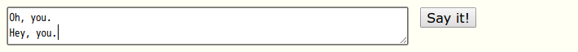
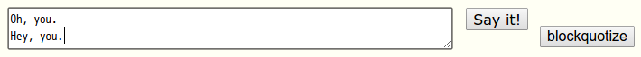
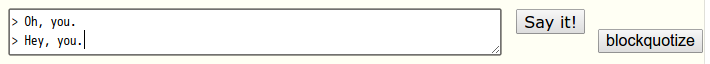

Lingr message blockquotize
==========================

Add benry button.

[This Greasemonkey script on OpenUserJS.org](https://openuserjs.org/scripts/aycabta/Lingr_message_blockquotize)

## Example

### original

### applied

The "blockquotize" button is next to textarea, so you can move focus to the button by tab key.

### pressed button that is added

